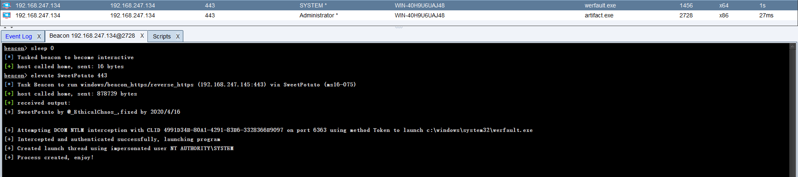

# SweetPotato

#### download

[SweetPotato](https://raw.githubusercontent.com/uknowsec/SweetPotato/master/SweetPotato-Webshell-new/bin/Release/SweetPotato.exe)

#### img

### SweetPotato-Webshell-new

### SweetPotato-Webshell-old

#### download

[SweetPotato.exe](https://raw.githubusercontent.com/uknowsec/SweetPotato/master/SweetPotato-Webshell-old/bin/Release/SweetPotato.exe)

#### img

### SweetPotato-Webshell-old

#### download

[SweetPotato.cna](https://raw.githubusercontent.com/uknowsec/SweetPotato/master/SweetPotato-CS-old/bin/Release/SweetPotato.cna)
[SweetPotato.exe](https://raw.githubusercontent.com/uknowsec/SweetPotato/master/SweetPotato-CS-old/bin/Release/SweetPotato.exe)

#### img

### Reference

https://github.com/CCob/SweetPotato
https://github.com/Tycx2ry/SweetPotato_CS
